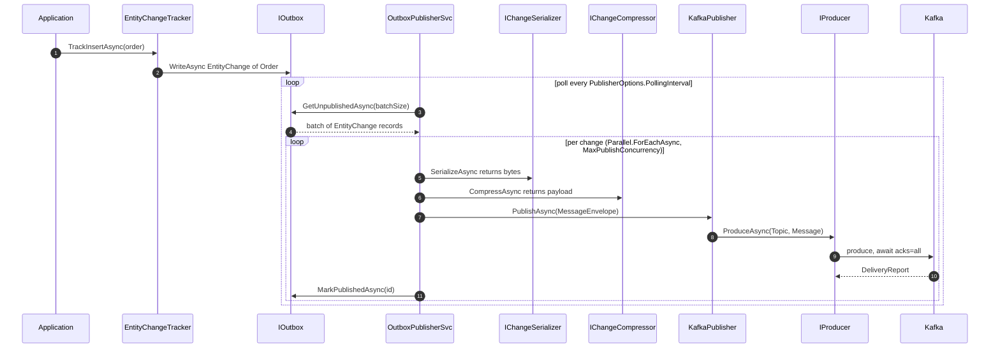
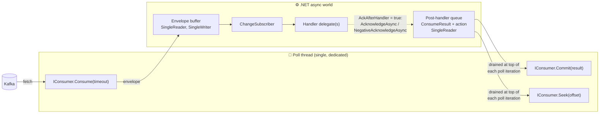
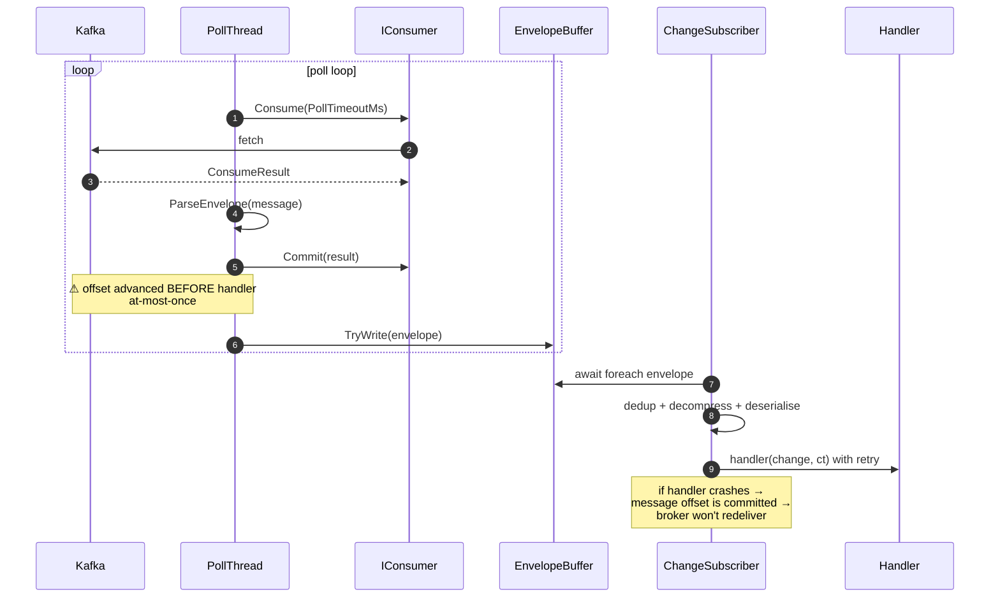
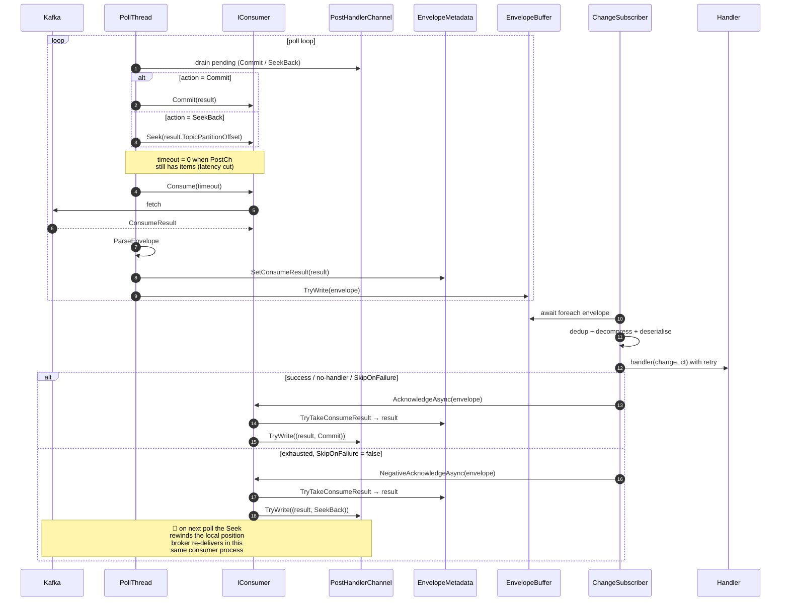
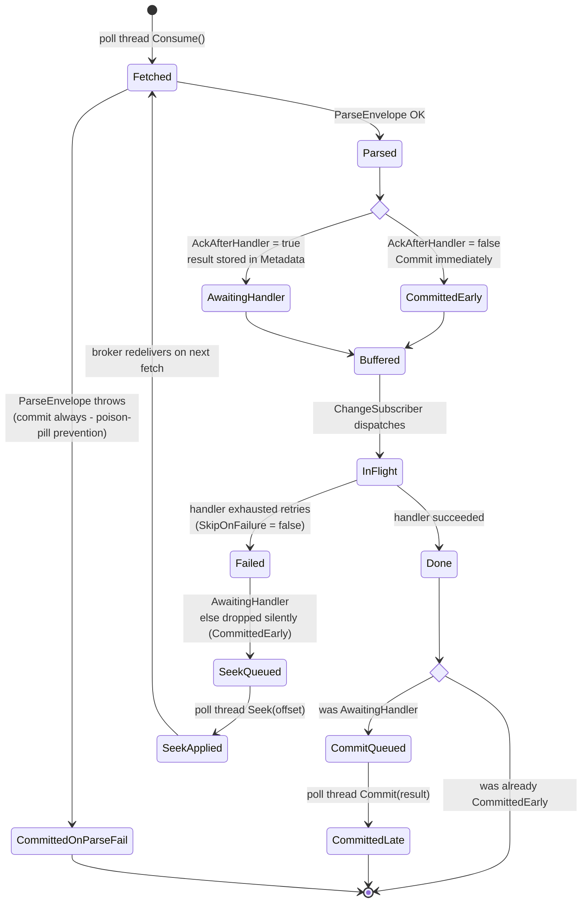

# RayTree.Plugins.Kafka

Kafka transport plugin for [RayTree](https://github.com/bitc0der/RayTree) — wires `KafkaPublisher` and `KafkaConsumer` into the outbox-based change-tracking pipeline using `Confluent.Kafka` under the hood.

## Installation

```bash
dotnet add package RayTree.Plugins.Kafka
```

Brings in `Confluent.Kafka` (and `librdkafka` native binaries) transitively. Requires `RayTree.Core`.

## What it provides

| Type | Role |
|---|---|
| `KafkaPublisher` | `IQueuePublisher` — single `IProducer<string, byte[]>` per instance; publishes one `Message<K,V>` per envelope to a configurable topic |
| `KafkaConsumer` | `IQueueConsumer` — owns a dedicated background thread that runs `Consume`/`Commit`/`Seek` (librdkafka thread-affinity requirement); buffers parsed envelopes through an in-process channel for the subscriber to drain |
| `KafkaPublisherOptions` / `KafkaConsumerOptions` | Configuration POCOs (bootstrap, topic, group, acks, etc.) |
| `KafkaBuilderExtensions` / `KafkaSubscriberExtensions` | Fluent builder hooks: `.UseKafka(...)` on the tracking builder, `.UseKafka<TEntity>(...)` on the subscriber builder |

## Pipeline overview

```
EntityChangeTracker
  → IOutbox.WriteAsync(EntityChange<TEntity>)
  → OutboxPublisherService (background poll)
       → serialise + compress  →  MessageEnvelope { Headers + byte[] Payload }
       → KafkaPublisher.PublishAsync
            → IProducer.ProduceAsync(topic, Message{Key, Value, Headers})
                                         ↓
                                       Kafka
                                         ↓
       → KafkaConsumer poll thread
            → IConsumer.Consume(timeout)
            → ParseEnvelope
            → buffer.TryWrite                   ← at-most-once: Commit happens here
       → ChangeSubscriber reads buffer
            → dedup → decompress → deserialise → invoke handler(s)
                                                 ← at-least-once: Commit happens here
```

---

## Publisher

### Quick start

```csharp
using RayTree.Core.Tracking;
using RayTree.Plugins.Kafka;
using RayTree.Plugins.Serializers.Json;

var tracker = await new ChangeTrackingBuilder()
    .UseSerializer<JsonSerializerPlugin>(_ => new JsonSerializerPlugin())
    .UseCompressor<NoOpCompressorPlugin>(_ => new NoOpCompressorPlugin())
    .ForEntity<Order>(e => e
        .UseOutbox(new InMemoryOutbox())
        .UsePublisher(new KafkaPublisher(new KafkaPublisherOptions
        {
            BootstrapServers = "broker1:9092,broker2:9092",
            Topic            = "entity_changes",
            Acks             = "all",          // durability over latency
        })))
    .BuildAsync();
```

### Publish sequence



### Message shape

`KafkaPublisher` builds each `Message<string, byte[]>` as:

| Field | Value |
|---|---|
| `Key` | Result of `KafkaPublisherOptions.KeySelector(envelope)` — defaults to `$"{EntityType}:{EntityId}"`, co-locating all changes for a given entity on the same partition and preserving per-entity ordering |
| `Value` | `envelope.Payload` (already serialised + compressed) |
| `Headers["entity_type"]` | UTF-8 string |
| `Headers["entity_id"]` | UTF-8 string |
| `Headers["change_type"]` | `Insert` / `Update` / `Delete` (UTF-8 string) |
| `Headers["correlation_id"]` | 16 raw bytes (`Guid.ToByteArray()`) |
| `Headers["version"]` | UTF-8 string |
| `Headers["timestamp"]` | UTF-8 string (ISO 8601 round-trip format `"O"`) |

### Producer construction

- One `IProducer<string, byte[]>` per `KafkaPublisher` instance, lazily built inside a `lock` on first use.
- `ProducerConfig`:
  - `BootstrapServers` from `options.BootstrapServers`
  - `Acks` from `options.Acks` (`"all"` / `"1"` / `"0"`); defaults to librdkafka default if `null`
  - `MessageMaxBytes` from `options.MessageMaxBytes` if set
- `Dispose()` flushes outstanding produces and closes the native handle.

### Publisher options reference

| Property | Default | Notes |
|---|---|---|
| `BootstrapServers` | `"localhost:9092"` | Comma-separated list |
| `Topic` | `"entity_changes"` | Destination topic for all entity types (use multiple `KafkaPublisher` instances for per-topic isolation) |
| `Acks` | `null` (librdkafka default) | `"all"` / `"1"` / `"0"` |
| `MessageMaxBytes` | `null` | Override producer-side message size limit |
| `KeySelector` | `envelope => $"{EntityType}:{EntityId}"` | Selects the Kafka partition key per message. Messages with the same key land on the same partition — override to shard by tenant, aggregate root, or any envelope field |

#### Custom partition key example

```csharp
new KafkaPublisherOptions
{
    BootstrapServers = "broker:9092",
    Topic            = "entity_changes",
    // Shard by tenant so all changes for a tenant land on the same partition.
    // Consumer-group members each own a disjoint set of partitions → parallel per-tenant processing.
    KeySelector = envelope => envelope.EntityId.Split(':')[0]   // "tenantId:entityId" → tenantId
}
```

---

## Consumer

The consumer is the more involved side because `librdkafka` requires every `Consume`, `Commit`, and `Seek` call on the **same OS thread**. The implementation isolates that thread and bridges to the rest of the world via a `Channel<T>`.

### Quick start

```csharp
using RayTree.Core.Tracking;
using RayTree.Plugins.Kafka;
using RayTree.Plugins.Serializers.Json;

var subscriber = new ChangeSubscriberBuilder()
    .UseSerializer(new JsonSerializerPlugin())
    .UseCompressor(new NoOpCompressorPlugin())
    .ForEntity<Order>(e => e
        .UseKafka(opt =>
        {
            opt.BootstrapServers = "broker1:9092";
            opt.Topic            = "entity_changes";
            opt.GroupId          = "order-projector";
            opt.FromEarliest     = true;
        })
        .OnInsert(async (change, ct) => { /* project read model */ }))
    .Build();
```

### Threading model



The poll thread is the **sole writer** to `Buf` and the **sole reader** of `PostCh`. The subscriber's worker tasks are the readers of `Buf` and the writers of `PostCh`. Confluent.Kafka native calls never escape the poll thread.

### Consume sequence — at-most-once (default)



### Consume sequence — at-least-once (`AckAfterHandler = true`)



### Consumer state model



### Consumer options reference

| Property | Default | Notes |
|---|---|---|
| `BootstrapServers` | `"localhost:9092"` | Comma-separated |
| `Topic` | `"entity_changes"` | Subscription target |
| `GroupId` | `"raytree-subscriber"` | Kafka consumer group (manage your own scheme) |
| `FromEarliest` | `true` | When the group has no committed offset: `true` → `Earliest`, `false` → `Latest` |
| `PollTimeoutMs` | `1000` | `Consume()` block timeout. Lower → snappier shutdown and snappier deferred-commit latency on idle topics, at the cost of CPU |
| `AckAfterHandler` | `false` | **At-most-once** (default) or **at-least-once** (`true`) — see below |

### `AckAfterHandler` — delivery-guarantee toggle

| | `false` (default) | `true` |
|---|---|---|
| When is the offset committed? | On the poll thread, immediately after parsing | Only after `ChangeSubscriber` confirms handler success |
| Crash between fetch and handler | Message lost — offset already past it | Broker redelivers on restart (offset never advanced) |
| Handler retry-exhaustion (`SkipOnFailure = false`) | Message lost (offset already advanced) | `Seek(TopicPartitionOffset)` on the poll thread → broker re-delivers in this same consumer's lifetime, no restart needed |
| Throughput / latency | Highest | One channel hop + extra librdkafka call per message |
| Required DOP | Any | **`MaxDegreeOfParallelism = 1` per partition** (see below) |

#### Why DOP = 1 is required for at-least-once Kafka

Kafka commits are monotonic by partition: `Commit(offset N)` implicitly confirms every offset `< N`. If two handler workers process messages from the same partition concurrently and worker B finishes first, its commit of offset N+1 effectively commits N as well — even if worker A is still working on N. A subsequent crash before A finishes will not redeliver A's message, breaking the guarantee.

```csharp
.UseSubscriberOptions(opt => opt.MaxDegreeOfParallelism = 1)
```

If your workload needs more parallelism for Kafka at-least-once, use partitions — one logical worker per partition.

#### Commit latency on idle topics

Deferred commits/seeks are drained at the **top of each poll iteration** on the poll thread. On a busy partition this happens almost immediately because the next `Consume()` returns quickly. On an idle partition the commit waits up to `PollTimeoutMs` for the current `Consume()` to time out. The implementation cuts this when work is piling up — once a post-handler item is queued, the next `Consume()` uses `TimeSpan.Zero` so subsequent items are processed without waiting. For tighter idle-topic responsiveness, lower `PollTimeoutMs` (trade: CPU).

#### How the `ConsumeResult` survives the hop

The original `ConsumeResult` is broker-private state — `ChangeSubscriber` shouldn't know about it. `KafkaConsumer` stashes it in `MessageEnvelope.Metadata` under the key `raytree.kafka.consume_result` via the internal `KafkaEnvelopeMetadata.SetConsumeResult` extension. `AcknowledgeAsync` / `NegativeAcknowledgeAsync` use `TryTakeConsumeResult`, which atomically reads-and-removes the entry — a double-Ack attempt becomes a silent no-op.

### Error handling

| Situation | Behaviour |
|---|---|
| `ParseEnvelope` throws (malformed message) | `Commit(result)` immediately, regardless of `AckAfterHandler`. Logged at `Warning`. Parse errors are not transient — committing past them prevents a poison-pill from blocking the partition |
| `KafkaException` with `Error.IsFatal` on consumer poll thread | `KafkaConsumer` logs `Warning`, drops pending deferred-ack actions referencing the dying consumer, disposes it, and runs an inline exponential-backoff `RebuildConsumer` on the same poll thread (re-runs `WaitForTopic` probe when enabled), bounded by `KafkaConsumerOptions.ConnectionRecovery` (a `KafkaConnectionRecoveryOptions`). On success logs `Information` (with duration) and resumes polling. On `MaxAttempts` exhaustion (or `ConnectionRecovery.Enabled = false`) logs `Error` and completes the buffer channel with the original exception. The broker redelivers via at-least-once semantics on the new consumer's join. |
| `KafkaException` with `Error.IsFatal` on publisher | The producer's error handler stamps a fault timestamp (atomic) and logs `Warning`. The next `PublishAsync` rebuilds the producer via the existing lazy `GetProducerAsync` path under `_buildLock` — disposes the dead producer on a normal call thread (not the librdkafka callback thread), re-runs the `WaitForTopic` probe, and logs `Information` (with duration). No inner backoff: the outbox-publisher retry loop provides the outer cadence. Set `ConnectionRecovery.Enabled = false` to surface the dead producer to callers instead of rebuilding. |
| Non-fatal `Exception` during `Consume()` | Logged at `Warning`, loop continues |
| Deferred `Commit` / `Seek` throws | Logged at `Warning` with the offset and action. The poll loop continues so one bad commit doesn't abort the whole consumer |
| `KafkaConsumer.Dispose` | Cancels `_disposeCts`; waits up to `2 × PollTimeoutMs + 200ms` for the poll thread to exit before freeing the native librdkafka handle (prevents `AccessViolationException`); a final drain flushes any pending Commits/Seeks that arrived during shutdown |

### Tuning notes

- **`PollTimeoutMs`**: the trade-off is between idle CPU usage and (a) shutdown latency (`Dispose()` waits up to `2 × PollTimeoutMs + 200 ms`) and (b) deferred-commit latency on idle topics. The default 1000 ms is a good production starting point.
- **`IsAssigned`**: public property that becomes `true` after the first successful `Consume()` call. Useful in tests as an alternative to `Task.Delay` before publishing — poll it instead of sleeping.
- **Topic partitioning**: the default `KeySelector` produces `"{EntityType}:{EntityId}"`, co-locating all changes for a given entity on the same partition. Combined with DOP = 1 per partition this gives ordered at-least-once delivery. Override `KeySelector` (e.g. to a tenant ID) to spread load across partitions while preserving per-key ordering within each partition.

---

## Integration with `IChangeTrackingBuilder` (DI / Hosting)

```csharp
builder.Services.AddChangeTracking(builder.Configuration, b => b
    .UseSerializer<JsonSerializerPlugin>(_ => new JsonSerializerPlugin())
    .UseCompressor<NoOpCompressorPlugin>(_ => new NoOpCompressorPlugin())
    .UseKafka(opt =>                              // global publisher
    {
        opt.BootstrapServers = "broker1:9092";
        opt.Topic            = "entity_changes";
        opt.Acks             = "all";
    })
    .ForEntity<Order>(e => e
        .UseOutbox(new InMemoryOutbox())
        .UseKafka(opt =>                          // per-entity consumer
        {
            opt.BootstrapServers = "broker1:9092";
            opt.Topic            = "entity_changes";
            opt.GroupId          = "order-projector";
            opt.AckAfterHandler  = true;          // opt in to at-least-once
        })
        .UseSubscriberOptions(o => o.MaxDegreeOfParallelism = 1)   // required for at-least-once
        .OnInsert(async (change, ct) => { /* ... */ })));
```

---

## Testing

Integration tests use [Testcontainers](https://dotnet.testcontainers.org/) to spin up a Kafka broker:

```bash
dotnet test tests/RayTree.Plugins.Kafka.Tests
```

Requires a working Docker daemon. Tests are marked `[NonParallelizable]` when they share a container and use unique topic names per test to avoid cross-test contamination.

## See also

- [RayTree main README](https://github.com/bitc0der/RayTree#readme) — pipeline overview, builder reference
- [RayTree.Plugins.RabbitMQ](https://github.com/bitc0der/RayTree/tree/main/src/RayTree.Plugins.RabbitMQ) — same plugin model for RabbitMQ
- [docs/in-memory-plugins.md](https://github.com/bitc0der/RayTree/blob/main/docs/in-memory-plugins.md) — in-process testing alternatives
