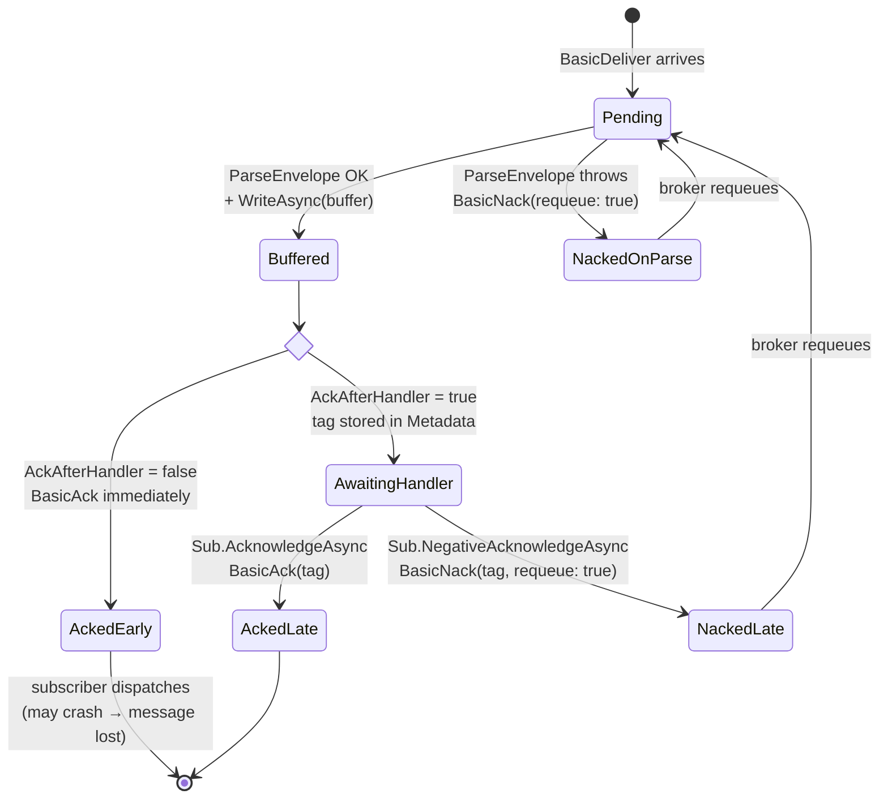

# RayTree.Plugins.RabbitMQ

RabbitMQ transport plugin for [RayTree](https://github.com/bitc0der/RayTree) — wires `RabbitMqPublisher` and `RabbitMqConsumer` into the outbox-based change-tracking pipeline.

## Installation

```bash
dotnet add package RayTree.Plugins.RabbitMQ
```

Brings in `RabbitMQ.Client` transitively. Requires `RayTree.Core`.

## What it provides

| Type | Role |
|---|---|
| `RabbitMqPublisher` | `IQueuePublisher` — declares an exchange and publishes serialised + compressed `MessageEnvelope`s as AMQP `basic.publish` calls |
| `RabbitMqConsumer` | `IQueueConsumer` — subscribes to a queue, parses `BasicDeliver` frames into `MessageEnvelope`s, buffers them via an unbounded `Channel<T>`, and acknowledges either at delivery time (at-most-once) or after handler completion (at-least-once) |
| `RabbitMqPublisherOptions` / `RabbitMqConsumerOptions` | Configuration POCOs (host, port, credentials, exchange/queue, routing) |
| `RabbitMqBuilderExtensions` / `RabbitMqSubscriberExtensions` | Fluent builder hooks: `.UseRabbitMq(...)` on the tracking builder, `.UseRabbitMq<TEntity>(...)` on the subscriber builder |

## Pipeline overview

```
EntityChangeTracker
  → IOutbox.WriteAsync(EntityChange<TEntity>)
  → OutboxPublisherService (background poll)
       → serialise + compress  →  MessageEnvelope { Headers + byte[] Payload }
       → RabbitMqPublisher.PublishAsync
            → BasicPublishAsync(exchange, routingKey, properties, body)
                                         ↓
                                     RabbitMQ
                                         ↓
       → RabbitMqConsumer.OnMessageReceived (broker push)
            → ParseEnvelope (headers + body)
            → buffer.WriteAsync                 ← at-most-once: ACK happens here
       → ChangeSubscriber reads buffer
            → dedup → decompress → deserialise → invoke handler(s)
                                                 ← at-least-once: ACK happens here
```

---

## Publisher

### Quick start

```csharp
using RayTree.Core.Tracking;
using RayTree.Plugins.RabbitMQ;
using RayTree.Plugins.Serializers.Json;

var tracker = await new ChangeTrackingBuilder()
    .UseSerializer<JsonSerializerPlugin>(_ => new JsonSerializerPlugin())
    .UseCompressor<NoOpCompressorPlugin>(_ => new NoOpCompressorPlugin())
    .ForEntity<Order>(e => e
        .UseOutbox(new InMemoryOutbox())
        .UsePublisher(new RabbitMqPublisher(new RabbitMqPublisherOptions
        {
            HostName        = "localhost",
            ExchangeName    = "entity_changes",
            ExchangeType    = "topic",
            RoutingKey      = "change",
            DeclareExchange = true,
            Durable         = true,
        })))
    .BuildAsync();
```

### Publish sequence

```mermaid
sequenceDiagram
    autonumber
    participant App as Application
    participant Tracker as EntityChangeTracker
    participant Outbox as IOutbox
    participant Loop as OutboxPublisherService<br/>(background)
    participant Ser as IChangeSerializer
    participant Cmp as IChangeCompressor
    participant Pub as RabbitMqPublisher
    participant Broker as RabbitMQ

    App->>Tracker: TrackInsertAsync(order)
    Tracker->>Outbox: WriteAsync(EntityChange<Order>)
    Note over Tracker,Outbox: synchronous - durably persisted before return

    loop poll every PublisherOptions.PollingInterval
        Loop->>Outbox: GetUnpublishedAsync(batchSize)
        Outbox-->>Loop: List<EntityChange<Order>>
        loop per change (Parallel.ForEachAsync, bounded by MaxPublishConcurrency)
            Loop->>Ser: SerializeAsync(change) → bytes
            Loop->>Cmp: CompressAsync(bytes) → payload
            Loop->>Pub: PublishAsync(MessageEnvelope { headers, payload })
            Pub->>Broker: BasicPublishAsync(exchange,<br/>routingKey, properties, body)
            Broker-->>Pub: ack
            Loop->>Outbox: MarkPublishedAsync(id)
        end
    end
```

### Routing-key construction

`RabbitMqPublisher` derives the routing key per message as:

```
{options.RoutingKey}.{envelope.EntityType}.{envelope.ChangeType, lowercase}
```

For an `Order` `Insert` with `RoutingKey = "change"`, the message is published to `change.MyApp.Models.Order.insert`. Combined with a topic exchange, subscribers can bind selectively (`change.*.insert`, `change.MyApp.Models.Order.#`, etc.).

### Headers and properties

Each publish populates `BasicProperties` with:

| Field | Value |
|---|---|
| `ContentType` | `application/octet-stream` |
| `MessageId` | `envelope.CorrelationId` (Guid → string) |
| `Timestamp` | `envelope.Timestamp` (Unix seconds) |
| `Headers["entity_type"]` | fully-qualified type name |
| `Headers["entity_id"]` | entity primary key (string) |
| `Headers["change_type"]` | `Insert` / `Update` / `Delete` |
| `Headers["version"]` | envelope schema version |

The serialised entity payload goes in `body` (already compressed by the time it reaches the publisher).

### Connection management

- One `IConnection` + one `IChannel` per `RabbitMqPublisher` instance.
- `InitializeAsync` opens both and (optionally) declares the exchange.
- A `SemaphoreSlim(1)` guards lazy connection construction so concurrent first-publish calls don't race.
- `Dispose()` closes the channel and connection synchronously via `.GetAwaiter().GetResult()`.

### Publisher options reference

| Property | Default | Notes |
|---|---|---|
| `HostName` | `"localhost"` |  |
| `Port` | `5672` |  |
| `UserName` / `Password` | `"guest"` / `"guest"` |  |
| `ExchangeName` | `"entity_changes"` | Where messages are published |
| `ExchangeType` | `"topic"` | Any AMQP exchange type (`topic`, `direct`, `fanout`, `headers`) |
| `RoutingKey` | `"change"` | Base routing key; suffixed with `.entity.changetype` per message |
| `DeclareExchange` | `true` | Set `false` if the exchange is pre-provisioned and your credentials lack declare rights |
| `Durable` | `true` | Survives broker restart (only relevant when declaring) |

---

## Consumer

### Quick start

```csharp
using RayTree.Core.Tracking;
using RayTree.Plugins.RabbitMQ;
using RayTree.Plugins.Serializers.Json;

var subscriber = new ChangeSubscriberBuilder()
    .UseSerializer(new JsonSerializerPlugin())
    .UseCompressor(new NoOpCompressorPlugin())
    .ForEntity<Order>(e => e
        .UseRabbitMq(opt =>
        {
            opt.HostName    = "localhost";
            opt.QueueName   = "order-projector";
            opt.ExchangeName= "entity_changes";
            opt.BindingKey  = "change.MyApp.Models.Order.#";
            opt.PrefetchCount = 32;
        })
        .OnInsert(async (change, ct) => { /* project read model */ }))
    .Build();

await subscriber.ConsumeFromConsumerAsync(consumer, ct);
```

### Consume sequence — at-most-once (default)

```mermaid
sequenceDiagram
    autonumber
    participant Broker as RabbitMQ
    participant Cons as RabbitMqConsumer
    participant Buf as Channel&lt;MessageEnvelope&gt;
    participant Sub as ChangeSubscriber
    participant Dedup as IDeduplicationStore
    participant H as Handler

    Note over Broker,Cons: AsyncEventingBasicConsumer<br/>autoAck = false, prefetch = N

    Broker->>Cons: ReceivedAsync(BasicDeliver)
    Cons->>Cons: ParseEnvelope(headers, body)
    Cons->>Buf: WriteAsync(envelope)
    Cons->>Broker: BasicAckAsync(deliveryTag)
    Note over Cons,Broker: ⚠ ACK BEFORE handler runs<br/>broker forgets the message

    Sub->>Buf: await foreach envelope
    Sub->>Dedup: TryMarkProcessedAsync(correlationId)
    alt duplicate
        Sub-->>Sub: skip
    else fresh
        Sub->>Sub: decompress + deserialise
        Sub->>H: handler(change, ct) with retry
        alt success / no-handler / SkipOnFailure
            Sub-->>Sub: done
        else exhausted, SkipOnFailure = false
            Sub->>Dedup: RevertProcessedAsync(correlationId)
            Sub-->>Sub: throw (but broker already ACKed — message lost)
        end
    end
```

### Consume sequence — at-least-once (`AckAfterHandler = true`)

```mermaid
sequenceDiagram
    autonumber
    participant Broker as RabbitMQ
    participant Cons as RabbitMqConsumer
    participant Meta as MessageEnvelope.Metadata
    participant Buf as Channel&lt;MessageEnvelope&gt;
    participant Sub as ChangeSubscriber
    participant H as Handler

    Broker->>Cons: ReceivedAsync(BasicDeliver)
    Cons->>Cons: ParseEnvelope
    Cons->>Meta: SetDeliveryTag(ea.DeliveryTag)
    Cons->>Buf: WriteAsync(envelope)
    Note over Cons,Broker: ✅ No ACK yet — broker holds the delivery

    Sub->>Buf: await foreach envelope
    Sub->>Sub: dedup + decompress + deserialise
    Sub->>H: handler(change, ct) with retry

    alt success / no-handler / SkipOnFailure
        Sub->>Cons: AcknowledgeAsync(envelope)
        Cons->>Meta: TryTakeDeliveryTag → tag (removes from metadata)
        Cons->>Broker: BasicAckAsync(tag)
        Note over Cons,Broker: 🟢 broker may now forget the message
    else exhausted, SkipOnFailure = false
        Sub->>Cons: NegativeAcknowledgeAsync(envelope)
        Cons->>Broker: BasicNackAsync(tag, requeue: true)
        Note over Cons,Broker: 🔁 message returned to queue for redelivery
    end
```

### Consumer state model



### Consumer options reference

| Property | Default | Notes |
|---|---|---|
| `HostName` / `Port` / `UserName` / `Password` | `localhost:5672` / `guest:guest` | |
| `QueueName` | `"entity_changes"` | The queue this consumer reads from |
| `DeclareQueue` | `true` | Declares the queue on `InitializeAsync` |
| `Durable` | `true` | Survives broker restart (only when declaring) |
| `PrefetchCount` | `10` | AMQP basic.qos — max unacked messages outstanding per channel |
| `ExchangeName` | `null` | When set, queue is bound to this exchange during init |
| `BindingKey` | `"#"` | Routing-key pattern for the binding (only used when `ExchangeName` is set) |
| `AckAfterHandler` | `false` | **At-most-once** (default) or **at-least-once** (`true`) — see below |

### `AckAfterHandler` — delivery-guarantee toggle

| | `false` (default) | `true` |
|---|---|---|
| When is `basic.ack` sent? | Immediately after buffering, in the broker delivery callback | Only after `ChangeSubscriber` confirms handler success |
| Crash between delivery and handler | Message lost — broker already ACKed | Broker requeues automatically on connection close |
| Handler retry-exhaustion (`SkipOnFailure = false`) | Message lost (already ACKed) | `BasicNack(requeue: true)` — broker redelivers |
| Throughput / latency | Highest | One extra broker round-trip per message |
| Duplicate delivery risk | Low (only on broker redelivery) | Higher — pair with `IDeduplicationStore` |

#### How the delivery-tag survives the hop

The delivery tag is broker-private state — `ChangeSubscriber` shouldn't know about it. `RabbitMqConsumer` stashes it in `MessageEnvelope.Metadata` under the key `raytree.rmq.delivery_tag` via the internal `RabbitMqEnvelopeMetadata.SetDeliveryTag` extension. `AcknowledgeAsync` / `NegativeAcknowledgeAsync` use the matching `TryTakeDeliveryTag` accessor, which atomically reads-and-removes the entry — so a double-Ack attempt is a silent no-op rather than the broker error `PRECONDITION_FAILED — unknown delivery tag`.

### Error handling

| Situation | Behaviour |
|---|---|
| `ParseEnvelope` throws (malformed message) | `BasicNack(requeue: true)` — broker requeues; **no log** (acknowledged exception to the project's logging-placement rule: no useful context is available inside the RabbitMQ delivery callback, and NACK/requeue is the only correct recovery) |
| Broker connection drops | The `IConnection` is closed; unacknowledged messages are returned to the queue automatically. A new connection must be established (typically by recreating the consumer) |
| `RabbitMqConsumer.Dispose` | Closes channel + connection synchronously; any in-flight unacked deliveries are requeued by the broker |

### Tuning notes

- **`PrefetchCount`** controls the maximum number of in-flight unacked messages per channel. With `AckAfterHandler = true`, this directly caps the at-risk window: if the process crashes, at most `PrefetchCount` messages will be redelivered.
- **`SubscriberOptions.MaxDegreeOfParallelism`** controls how many envelopes `ChangeSubscriber` processes concurrently from the buffer. Combine with `PrefetchCount` for end-to-end backpressure.
- The internal `Channel<MessageEnvelope>` is **unbounded** — if your subscriber falls behind, RAM grows. Set `PrefetchCount` to bound it from the broker side.

---

## Integration with `IChangeTrackingBuilder` (DI / Hosting)

```csharp
builder.Services.AddChangeTracking(builder.Configuration, b => b
    .UseSerializer<JsonSerializerPlugin>(_ => new JsonSerializerPlugin())
    .UseCompressor<NoOpCompressorPlugin>(_ => new NoOpCompressorPlugin())
    .UseRabbitMq(opt =>                          // global publisher
    {
        opt.HostName     = "rabbit";
        opt.ExchangeName = "entity_changes";
    })
    .ForEntity<Order>(e => e
        .UseOutbox(new InMemoryOutbox())
        .UseRabbitMq(opt =>                      // per-entity consumer
        {
            opt.QueueName    = "order-projector";
            opt.ExchangeName = "entity_changes";
            opt.BindingKey   = "change.#.Order.#";
            opt.AckAfterHandler = true;          // opt in to at-least-once
        })
        .OnInsert(async (change, ct) => { /* ... */ })));
```

The fluent extension `.UseRabbitMq<TEntity>(opt => ...)` on the subscriber builder is equivalent to `.UseConsumer(new RabbitMqConsumer(opt))`.

---

## Testing

Integration tests use [Testcontainers](https://dotnet.testcontainers.org/) to spin up RabbitMQ:

```bash
dotnet test tests/RayTree.Plugins.RabbitMQ.Tests
```

Requires a working Docker daemon. The project pulls `rabbitmq:3-management` on first run and tears it down after the suite.

## See also

- [RayTree main README](https://github.com/bitc0der/RayTree#readme) — pipeline overview, builder reference
- [RayTree.Plugins.Kafka](https://github.com/bitc0der/RayTree/tree/main/src/RayTree.Plugins.Kafka) — same plugin model for Kafka
- [docs/in-memory-plugins.md](https://github.com/bitc0der/RayTree/blob/main/docs/in-memory-plugins.md) — in-process testing alternatives
